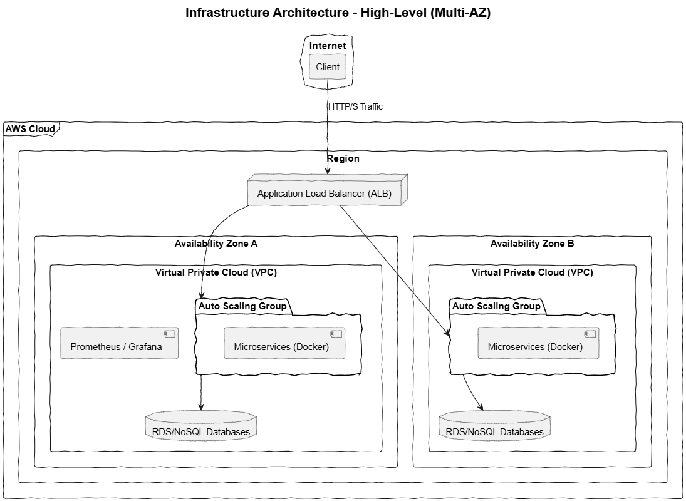
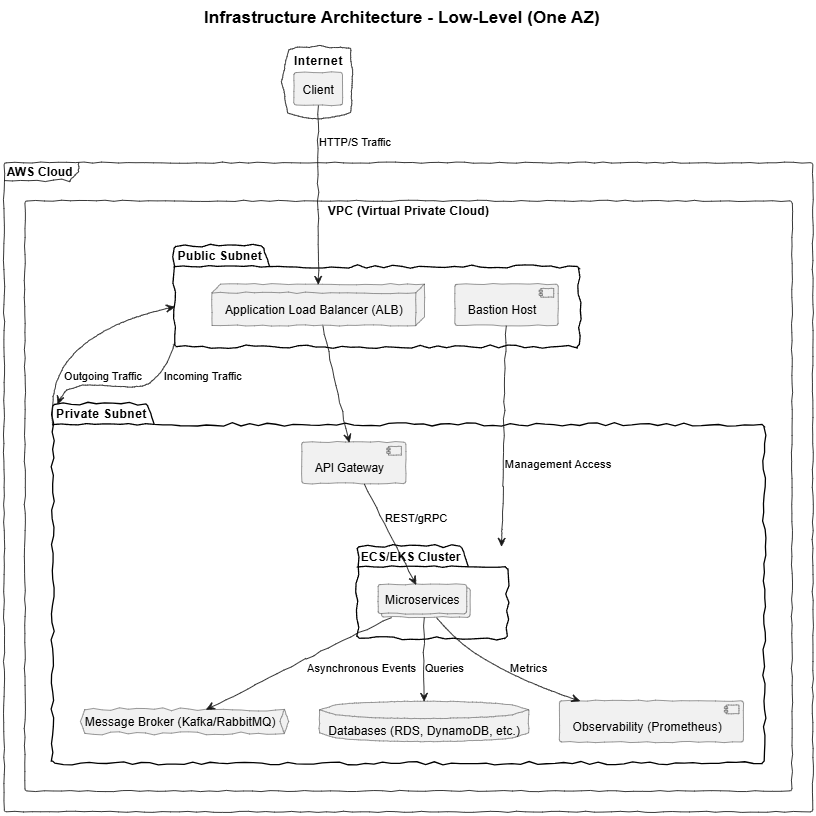

# Infrastructure Architecture for Bullstra™

## Overview
This document describes the infrastructure architecture of the logistics and supply chain management system, Bullstra™. The infrastructure is designed to be robust, highly available, resilient, and scalable, utilizing Amazon Web Services (AWS) and DevOps best practices.

## High-Level Architecture
The high-level architecture focuses on load distribution and high availability. A Multi-AZ (Multiple Availability Zone) approach is used to ensure the system can withstand the failure of an entire AWS zone.

**Key Components:**

* **Cloud Provider**: AWS is the main infrastructure provider.
* **DNS/CDN**: CloudFlare is used for DNS management, CDN, and DDoS protection.
* **Load Balancer**: An AWS Application Load Balancer (ALB) distributes HTTP/HTTPS traffic among the microservices.
* **Auto Scaling Groups (ASG)**: Configured for container clusters (ECS/EKS) or EC2 instances running the microservices, automatically scaling capacity based on demand.
* **Availability Zones (Multi-AZ)**: Microservices, databases, and load balancers are deployed in at least two Availability Zones to ensure high availability and resilience.
* **Databases**: Various types of databases are used and distributed in a Multi-AZ setup, such as Amazon RDS for PostgreSQL/MySQL, Amazon DocumentDB, DynamoDB, and Amazon ElastiCache for Redis.
* **Observability**: Services like Prometheus and Grafana on EC2 instances are used for metrics collection and visualization.
* **Secure Access**: An EC2 Bastion Host (or Jump Box) is used as a single fortified entry point to access the private production network.

## Low-Level Architecture
The low-level architecture details the internal network configuration within a single Availability Zone.

**Key Components:**

* **Virtual Private Cloud (VPC)**: A logically isolated virtual network in AWS that hosts all production resources.
* **Public and Private Subnets**: The VPC is segmented into public subnets (for the ALB and Bastion Host) and private subnets (for microservices and databases).
* **API Gateway**: Acts as the entry point for all external requests. It handles routing, centralized authentication, and other security functions.
* **Container Clusters (ECS/EKS)**: Microservices are packaged in Docker images and run in container clusters within the private subnet.
* **Database Services**: Databases are deployed in the private subnet and are only accessible by the microservices.
* **Message Buffer**: Apache Kafka or RabbitMQ are used for asynchronous communication between microservices, implementing an event-based architecture.
* **Image Registry**: Docker images are stored in AWS ECR (Elastic Container Registry).

## Infrastructure as Code (IaC)
The entire infrastructure is defined and managed using Terraform. This ensures the reproducibility of QA and Production environments and allows for versioning infrastructure changes.

The Terraform files are organized into the following directories for better management:

* `vpc/`: Defines the VPC and subnets.
* `load_balancing/`: Defines the ALB and target groups.
* `ecs_cluster/`: Defines the ECS cluster and services.
* `rds_databases/`: Defines the RDS databases.
* `monitoring/`: Defines the resources for Prometheus and Grafana.
* `security/`: Defines the security groups and the Bastion Host.

## Deployment
CI/CD pipelines (with GitHub Actions or AWS CodePipeline) are responsible for automating the deployment of the infrastructure and microservices. Infrastructure changes are applied via Terraform, and microservice deployments are performed on the container clusters.