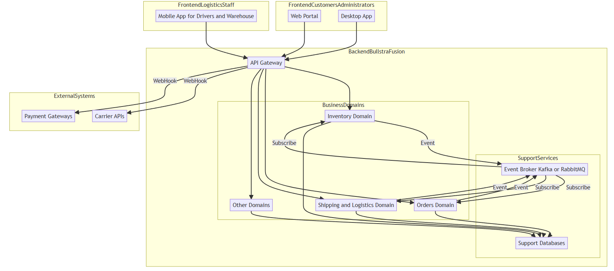
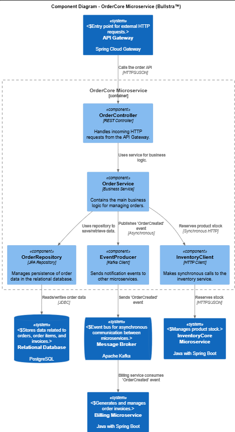

# Software Architecture

## High-Level Architecture

The system architecture is based on a **robust and distributed microservices** approach, designed to optimize the management of products, inventory, orders, and shipments across a supply chain.

The microservices are grouped into key business domains:

- Inventory  
- Orders  
- Shipping and Logistics  
- Customers and Users  
- Suppliers and Procurement  
- Notifications  
- Analytics and Reporting  

An **API Gateway** acts as the centralized entry point for all external requests (e.g., from the frontends).  
Communication between the API Gateway and most microservices is handled via **REST (Representational State Transfer)**.

### Event-Driven Architecture (EDA)

Asynchronous communication between microservices is achieved through an **event-driven architecture**, using a message broker such as:

- Apache Kafka  
- RabbitMQ  

Example event flow:

1. A `OrderCreated` event is emitted.  
2. It is consumed by the `OrderProcessing` microservice.  
3. That service may emit events like `StockReserved` and `PendingShipmentNotification`.

### Multi-Platform Frontend

- **Web**: Main portal for customers and administrators.  
- **Mobile**: App for drivers and warehouse staff.  
- **Desktop**: Advanced control panel for real-time monitoring.

## Low-Level Architecture

This section details technical aspects and key implementation decisions.

### Backend Programming Languages

- **Java (Spring Boot)**: For robust transactional microservices (`OrdersCore`, `InventoryCore`, `UsersCore`).
- **Python (FastAPI / Django)**: For route optimization and predictive analytics (`RouteOptimization`, `PredictiveAnalysis`).
- **Go**: For high-performance services like `StockControl` or data ingestion in `VehicleTracking`.
- **Node.js (Express / NestJS)**: For the API Gateway and admin interfaces.
- **C# (.NET Core)**: For `SuppliersCore` with complex business logic.

### Backend Design Patterns

- **Circuit Breaker**: To prevent cascading failures between microservices.
- **Saga Pattern**: To manage complex distributed transactions.
- **gRPC**: For high-performance internal communication with strongly typed contracts (e.g., between `InventoryCore` and `StockControl`).
- **GraphQL** *(optional)*: For flexible API exposure to frontend clients.

### Databases

Multiple databases are used depending on data type and microservice purpose:

- **PostgreSQL**: For transactional data (`OrdersCore`, `InventoryCore`, `UsersCore`).
- **MongoDB**: For flexible documents like product catalogs.
- **Redis**: For caching and fast stock counters in `StockControl`.
- **Elasticsearch**: For full-text search (`ProductCatalog`, `ShippingCore`).
- **InfluxDB**: For time-series data in `VehicleTracking`.

*For more details, search 'component_diagram(C4_level3.puml)' in carpet called 'various_diagrams'